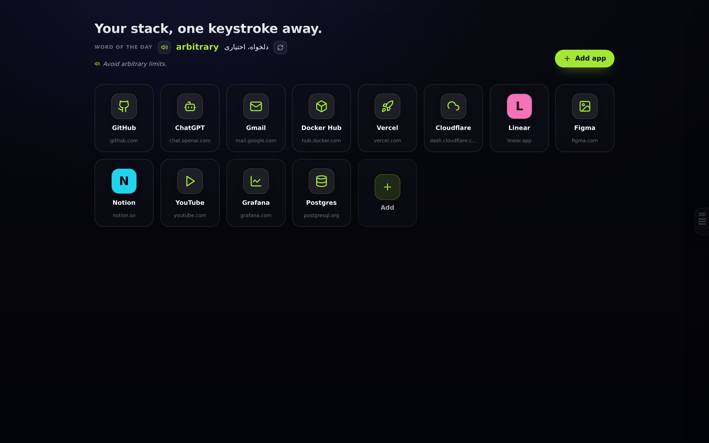
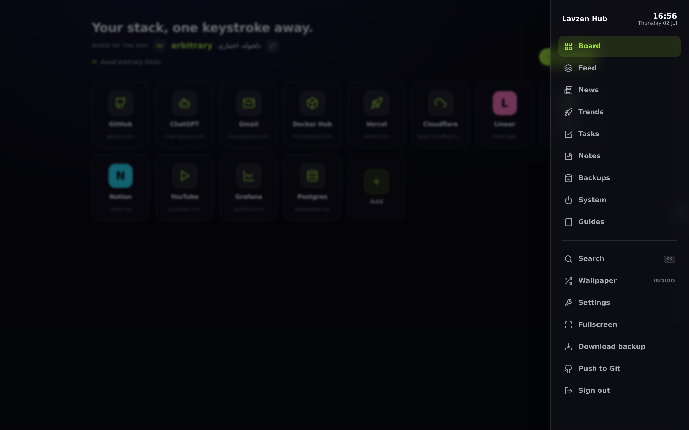
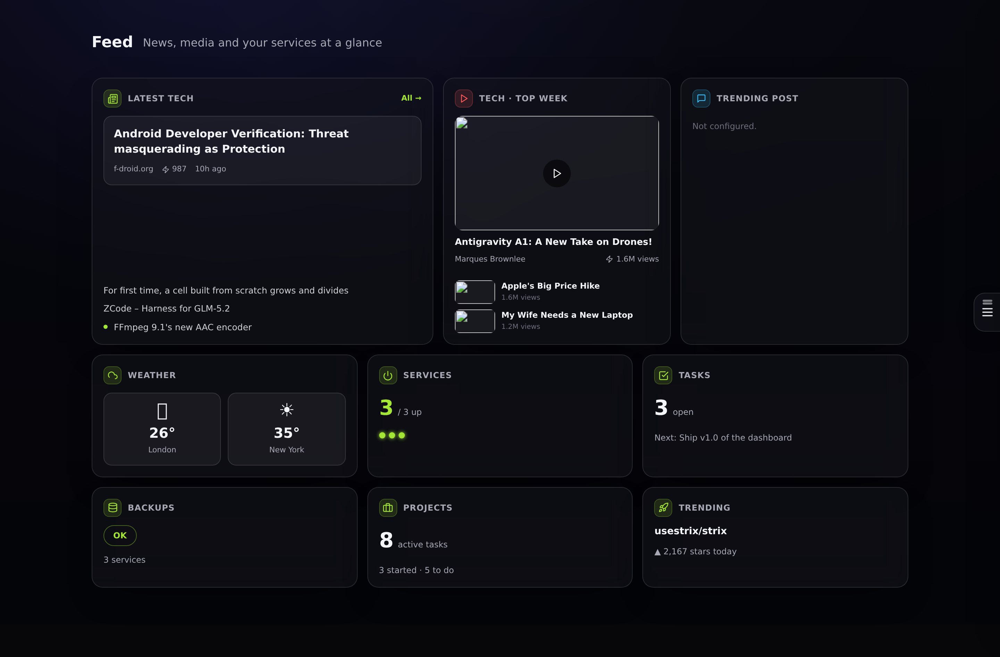
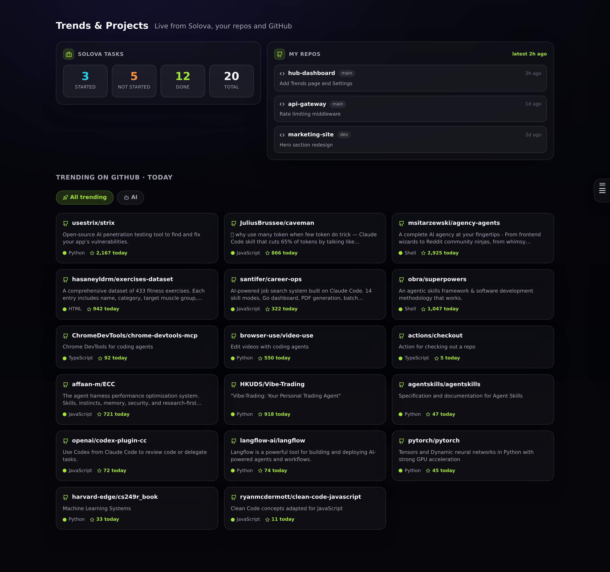
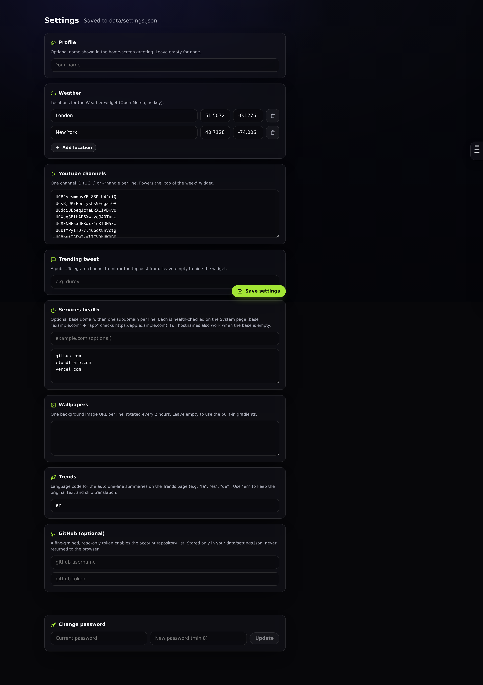

# Lavzen Hub

A self-hosted personal dashboard and start page. One private place for your app
launcher, tech news, media, service health, tasks, notes and backups, protected
by a single password and served from one small PHP container.

It ships with an optional Chrome extension that turns every new browser tab into
your hub, embedded full screen.

---

## Screenshots

| Home (launcher) | Floating menu |
| --- | --- |
|  |  |

| Feed | Trends and Projects |
| --- | --- |
|  |  |

| Settings |
| --- |
|  |

---

## What it is

- **Self-hosted.** You run it on your own machine or server. Your data lives in
  flat JSON files on disk. There is no external account, no telemetry, and no
  database to operate.
- **Single user.** One password protects everything. Sessions are a 30-day
  encrypted cookie.
- **Keyless by default.** Every live data source it uses is public and needs no
  API key: Open-Meteo, Hacker News, YouTube RSS, a public Telegram channel,
  GitHub trending, and a free translation endpoint.
- **Small.** A React front end built to static files, served by a single
  `php:8.2-apache` container. No Node.js runtime in production.

## How the Chrome extension fits in

The hub is a normal website you host yourself. The included extension
(`extension/`) overrides the browser's new-tab page and loads your hub inside a
full-screen iframe, so opening a new tab drops you straight into your dashboard.

Because a self-hosted hub sends anti-clickjacking headers (`X-Frame-Options` and
a `frame-ancestors` Content-Security-Policy), a normal page cannot embed it. The
extension removes only those two response headers, and only for the sub-frame
request to the single host you configure. The server is never modified. See
[docs/EXTENSION.md](docs/EXTENSION.md).

---

## Features

### Home (Board)
- App launcher grid: add, edit, delete and drag-to-reorder tiles.
- Tile icons resolve automatically from the site favicon, with a colored
  lettered-avatar fallback, or you can pick from a built-in icon set.
- A creative greeting that changes on every visit.
- Word of the day: a term with its translation and an example sentence, each
  with text-to-speech pronunciation.
- Intentionally minimal: only the launcher and the word of the day.

### Floating menu
- A launcher docked to the right edge of the screen, vertically centered.
- Draggable up and down; its position is remembered.
- Semi-transparent when idle and opaque on hover, like a mobile accessibility
  button.
- Opens a slide-in sheet with all navigation, quick actions and a live clock.
- Closes with the Escape key or by tapping the backdrop.

### Feed
- Latest tech news with a cover image, plus a short headline list.
- Top technology videos of the week.
- A trending social post mirrored from a public Telegram channel.
- Compact tiles for weather, service health, open tasks, backups, project tasks
  and the top trending repository.

### News
- A technology feed sourced from Hacker News.
- Topic tabs: Top Tech, AI and ML, Programming, DevOps and Cloud, Show HN.
- Article cover images (Open Graph), points, comment counts and age.
- Near-live: refreshed on a short cache so a page refresh shows fresh stories.

### Trends and Projects
- GitHub daily trending repositories, plus an AI-focused slice.
- Each repository gets an automatic one-line summary in your chosen language.
- A list of your local git repositories with their last commit.
- Task statistics (started, not started, done) from an external project tool,
  fed by an optional exporter script.

### Tasks
- A personal to-do list with priorities and due dates.
- Optional browser notifications when a task is due.

### Notes
- Master-detail notes with autosave.

### Backups
- Per-service backup status, recent archive names with sizes and ages, and the
  latest backup log. Reads a status file produced by your own backup job.

### System
- Health checks for the services and domains you configure, over HTTPS.
- An optional Windows plus WSL autostart toggle (ignored on other platforms).

### Guides
- Built-in playbooks on ideation, workflow, home-lab operations and working
  with AI tools.

### Everywhere
- Command palette (Ctrl or Cmd + K) for quick navigation and link search.
- Settings page to configure everything without touching files.
- Minimal, professional background set that rotates every two hours; shuffle on
  demand, or supply your own image URLs.
- One-click backup that downloads a ZIP of the whole app.
- Optional one-click "push to Git" if you keep the app in a git repository.

### Security
- Single password stored as a bcrypt hash; the raw password is only ever
  verified, never stored.
- Session token is AES-256-GCM encrypted and authenticated, delivered as an
  HttpOnly, Secure, SameSite=Lax cookie valid for 30 days.
- Same-origin (CSRF) guard on every state-changing request.
- Strict security headers via `.htaccess`: Content-Security-Policy, nosniff,
  no-referrer, frame denial, and no-index directives.

---

## Quick start (Docker)

```bash
git clone https://github.com/<your-username>/hub-dashboard.git
cd hub-dashboard
docker compose -f docker/docker-compose.example.yml up -d --build
```

Then open `http://localhost:8086/setup.php` once to choose your password. It
writes `app/config.php` for you. Open `http://localhost:8086/` and sign in.

The container serves the pre-built front end in `app/`. To rebuild the front end
after changing anything under `web/`, see [Development](#development).

## First-run setup

The app needs an `app/config.php` holding your password hash and a random
secret. You have two options:

1. Visit `/setup.php` in the browser and pick a password (recommended). It
   generates `config.php` and a fresh secret automatically, then refuses to run
   again while `config.php` exists.
2. Copy `app/config.example.php` to `app/config.php` and fill it in by hand. The
   file documents how to generate the bcrypt hash and the secret.

`config.php` is git-ignored and must never be committed.

## Configuration

Everything a normal user needs is on the in-app **Settings** page, saved to
`app/data/settings.json`:

- Display name for the greeting.
- Weather locations (latitude and longitude).
- YouTube channel IDs for the weekly-top-videos widget.
- A public Telegram channel for the trending-post widget.
- Services to health-check (a base domain plus subdomains, or full hostnames).
- Background wallpaper image URLs.
- Trends summary language (a two-letter code, or `en` to skip translation).
- An optional GitHub token and username.
- Password change.

See [docs/CONFIGURATION.md](docs/CONFIGURATION.md) for the full schema and
defaults.

## The Chrome extension

Load `extension/` as an unpacked extension (chrome://extensions, enable
Developer mode, "Load unpacked"), open its options, and enter your hub URL.
Every new tab now opens your hub. Details and Firefox notes are in
[docs/EXTENSION.md](docs/EXTENSION.md).

## Optional integrations

- **Project task stats.** A host script, `scripts/hub-refresh.py`, can query an
  external project database (for example a Postgres kanban) and your local git
  repositories, then write `app/data/projects.json`, which the Trends page
  reads. Run it on a cron. Adapt the query to your own schema.
- **GitHub account repositories.** Add a fine-grained, read-only token in
  Settings to list your repositories (planned surface; the token field is
  already in place).

## Development

The front end is React 18 + TypeScript + Vite. The source is in `web/`; the
build output is copied into `app/` (served by PHP).

```bash
cd web
npm install
npm run build
cp dist/index.html ../app/index.html
rm -f ../app/assets/index-*.js ../app/assets/index-*.css
cp dist/assets/index-*.js dist/assets/index-*.css ../app/assets/
```

For a live dev server against a running backend, use `npm run dev` and proxy
`/api` to your PHP host.

## Project structure

```
app/            Deployable PHP app (served as the web root)
  api/          JSON endpoints (auth, data, news, weather, ytfa, tweet,
                trending, projects, system, status, backup, push, icon, img,
                settings, wallpapers)
  lib.php       Auth helpers (token, cookie, CSRF guard)
  lib_settings.php  Settings loader with defaults
  setup.php     First-run password setup
  config.example.php
  index.html    Built front-end entry
  assets/       Built JS and CSS
  data/         Runtime JSON storage (git-ignored)
web/            React + TypeScript + Vite source
  src/pages/    Board, Feed, News, Trends, Tasks, Notes, Backups, System,
                Guides, Settings, Palette
extension/      Chrome new-tab iframe extension
scripts/        Optional host-side exporter (projects.json)
docs/           Documentation and screenshots
docker/         Dockerfile and example compose file
```

An orientation guide written for AI coding agents is in
[AGENTS.md](AGENTS.md).

## License

MIT. See [LICENSE](LICENSE).


---

## ⭐ Star History

<a href="https://star-history.com/#morpheusadam/hub-dashboard&Date">
  
</a>

<div align="center">

### If this project helps you, please give it a ⭐

A star helps other developers discover **hub-dashboard** and supports continued development.

</div>
